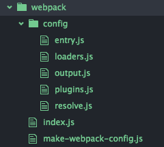
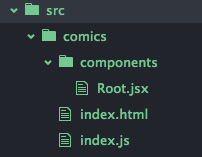
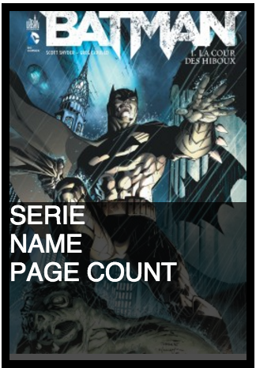

# lpdw-frontend

## Step 1 : Project initialisation

* Clone git lpdw-frontend project
* Configure NPM

## Step 2 : Install server side

* Install git server side submodule :

`git submodule add git@github.com:pebie/pebie-server.git`

* Understanding server side (theory)

This is a server based on **Loopback** and **Mongodb**.

**Loopback** allows you to quickly create a dynamic end-to-end rest APIs.

**MongoDB** is an open-source, document database designed for ease of development and scaling.

* Testing server side
  * In a command shell terminal launch `sudo mongodb`
  * cd to `./pebie-server`
  * run `npm install`
  * run `node .`
  * Open Robomongo and verify entries
  * Open `http://localhost:3001/explorer` and enjoy to play with API

## Step 3 : Adding webpack configuration and building first react component

### Step 3.1 : Webpack

*This webpack configuration use ES6 new feature. Babel will be use to transpile files. You need to use babel < 6 to run this sample.*

* Install git server side submodule :

`git submodule add git@github.com:pebie/pebie-webpack.git`

* Understanding webpack (theory)



* Adding node module into package.json

```javascript
"babel-core": "^5.8.2",
"babel-loader": "^5.3.2",
"clean-webpack-plugin": "^0.1.4",
"extract-text-webpack-plugin": "^0.9.1",
"html-webpack-plugin": "^1.6.2",
"open": "0.0.5",
"optimist": "^0.6.1",
"path": "^0.12.7",
"react": "^0.14.3",
"react-dom": "^0.14.3",
"react-hot-loader": "^1.3.0",
"webpack": "^1.12.8",
"webpack-dev-server": "^1.12.1"
```
*babel version should be < 6.0*

### Step 3.2: First react component

* Scaffolding your first react application



## Step 4: Making layout and use CSS

* Install css loader

*see loader.js webpack config file for more details*

```javascript
"css-loader"
"sass-loader"
"style-loader"
"normalize.css"
```

* Building `Header.jsx` and `Footer.jsx`using react and css

## Step 5: Building comics item components

* Install image loader

```javascript
"file-loader"
"image-webpack-loader"
```
* Create a component `Comics` that will wrap `ComicsItem`
* Use system grid or flex css to display multiple item in a grid
* Create a rollover effect on `Comics Item` by using the state



*Data should be hard coded for this step*
